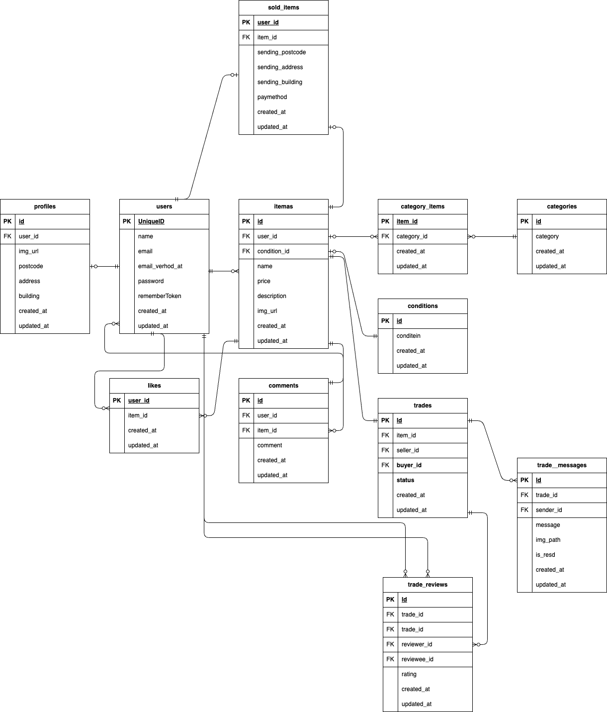

# フリマアプリ

## アプリケーション概要

ユーザー登録・商品出品・購入・取引メッセージ・評価などを行う
フリマアプリケーションです。

---

## 環境構築

### 1. リポジトリをクローン

1.git clone git@github.com:Tomo-Taka6387/first-exam.git


### 2. Docker Desktop を起動

### 3. コンテナのビルド & 起動
docker-compose up -d --build


※ MySQL が OS によって起動しない場合、  
各自の環境に応じて `docker-compose.yml` の MySQL 設定を調整してください。

### 4. コンテナの起動確認

docker ps


---

## 🧱 Laravel 環境構築

### 1. PHP コンテナに入る

1.docker-compose exec php bash


### 2. Composer 依存関係をインストール


### 3. `.env` を作成

`.env.example` をコピーして `.env` に変更（または新規作成）。

```env
DB_CONNECTION=mysql
DB_HOST=mysql
DB_PORT=3306
DB_DATABASE=laravel_db
DB_USERNAME=laravel_user
DB_PASSWORD=laravel_pass

MAIL_MAILER=smtp
MAIL_HOST=mailhog
MAIL_PORT=1025
MAIL_USERNAME=null
MAIL_PASSWORD=null
MAIL_ENCRYPTION=null
MAIL_FROM_ADDRESS=example@example.com
MAIL_FROM_NAME="${APP_NAME}"

### 4. アプリケーションキー生成

php artisan key:generate

### 5. マイグレーション・シーディング

php artisan migrate --seed


＃使用技術

*PHP8.4.4.4

*Laravel8.83.8

*MySQL9.2.0


## URL

- アプリ環境: [http://localhost/]
- phpMyAdmin: [http://localhost:8080/]

## 👤 ログイン用テストアカウント

### **ユーザー1（出品・購入）**

name: テスト 太郎
email: test@test.com

password: password


### **ユーザー2（出品・購入）**
name: テスト 次郎
email: jiro@test.com

password: password


### **ユーザー3（紐づきなし）**
name: テスト 三郎
email: saburo@test.com

password: password

＃ER 図




##  Seeder（初期データ内容）

本アプリでは動作確認を行いやすいよう、以下のテーブルに初期データが自動投入されます。

### ✔ UserTableSeeder（ユーザー）

- User1：商品 CO01〜CO05 を出品
- User2：商品 C006〜C010 を出品
- User3：どこにも紐づかないユーザー

合計 3 ユーザーが作成されます。

---

### ✔ TradeSeeder（取引データ）

User1・User2 の間で **合計 10 件の取引** が自動生成されます。

#### user1 の商品（1〜5）
→ user2 が購入
seller_id: 1
buyer_id: 2
status: chatting


#### user2 の商品（6〜10）
→ user1 が購入
item_id: 6〜10
seller_id: 2
buyer_id: 1
status: chatting


---

### ✔ TradeMessageSeeder（取引メッセージ）

作成済みの全取引に対し、1件ずつメッセージを生成しています。
trade_id: （各取引ID）
sender_id: seller_id
message: "取引メッセージを送ります。"
is_read: 0（未読）

##  メール認証設定（Mailtrap）

1. [Mailtrap](https://mailtrap.io/) に会員登録
2. Mailbox の「Integrations」から **Laravel 7.x and 8.x** を選択
3. `.env` のメール関連設定をコピー＆ペースト
4. `MAIL_FROM_ADDRESS` は任意のメールアドレスを指定


---

## 🔧 注意点・仕様

### 1. チャット機能
- `trade_messages` によって取引ごとのメッセージが管理されます。
- `is_read` フラグにより未読バッジ表示。

### 2. 評価機能
- 取引完了後、`trade_reviews` テーブルへ評価を保存。
- Seeder ではデータを作成せず、手動で確認可能。

### 3. カテゴリ機能
- category_items が商品との多対多を管理。

---

##  PHPUnit テスト

### 1. テスト用 DB 作成

docker-compose exec mysql bash
mysql -u root -p
# パスワード: root
create database test_database;


### 2. テスト用マイグレーション実行
docker-compose exec php bash
php artisan migrate:fresh --env=testing


### 3. テスト実行
./vendor/bin/phpunit


---

## ⚠️ その他注意事項

1. **外部キー制約について**
   trades・trade_messages・trade_reviews などの関連データは
   cascade 設定により親を削除すると自動で削除されます。

2. **取引ステータスについて**
   - chatting（取引中）
   - completed（取引完了）
   - canceled（キャンセル）

3. **Seeder 実行について**
   動作確認に必須のデータが含まれるため、
   環境構築時は必ず以下を実行してください。
   php artisan migrate:fresh --seed

